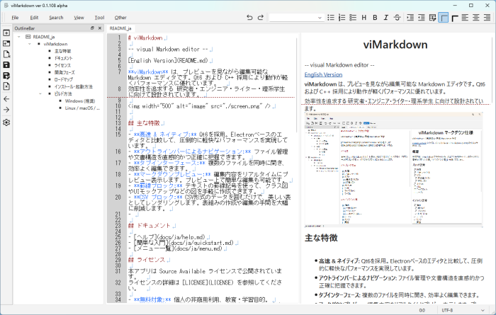

# viMarkdown

-- visual Markdown editor --

[English Version](README.md)

**viMarkdown** は、プレビューを見ながら編集可能な Markdown エディタです。Qt6 および C++ 採用により動作が軽くパフォーマンスに優れています。  
効率性を追求する 研究者・エンジニア・ライター・理系学生 に向けて設計・開発されています。

<!---->

## ■ 主な特徴
- **エディタとプレビューの完全同期**
  カーソル位置や編集内容がリアルタイムに同期。Markdownの構造を保ったまま、直感的に編集できます。
- **プレビュー上で直接編集**
  エディタだけでなく、プレビュー画面からも文字の挿入・削除が可能。見たままの状態（WYSIWYG）で編集作業を完結できます。
- **viキーバインド（viコマンド）に対応**
  ホームポジションから手を離さずに、テキストの編集やカーソル移動を高速で行えるviコマンドをサポートしています。
- **強力なGrep（一括検索）機能**
  複数ファイルやフォルダ全体から目的の記述を瞬時に抽出。効率的な文書検索と編集を強力にサポートします。
- **アウトラインベースのナビゲーション**
  長文でもアウトラインを把握しながら、必要な箇所へ素早く移動。文書構造を意識した効率的な編集をサポートします。
- **独自ブロックとSVG描画サポート**
  テキストベースの「罫線ブロック」や「CSVブロック」に加え、図形やダイアグラムをコードのように表現できる「SVG」の表示・描画サポートを搭載しています。
- **Qt6/C++によるネイティブ実装**
  Electronベースのエディタとは一線を画す、圧倒的な軽量さと高速な動作を実現しています。

<!--
- **高速 & ネイティブ:** Qt6/C++ を採用。Electronベースのエディタと比較して、圧倒的に軽快なパフォーマンスを実現しています。
- **アウトラインバーによるナビゲーション:** ファイル管理や文書構造を直感的かつ正確に把握できます。
- **タブインターフェース:** 複数のファイルを同時に開き、効率よく編集できます。
- **マークダウンプレビュー:** 編集内容をリアルタイムにプレビュー表示します。プレビュー上で簡単な編集（文字挿入・削除）も可能です。
- **罫線ブロック:** テキストの罫線記号を使って、クラス図やUIモックアップなどの図を手軽に作成できます。
- **CSV ブロック:** CSV形式のデータを囲むだけで、美しい表としてレンダリングします。表組みの作成や編集の手間を大幅に削減します。
-->

## ■ ドキュメント
- [ヘルプ](docs/ja/help.md)
- [簡単な入門](docs/ja/quickstart.md)
- [メニュー一覧](docs/ja/menu.md)
- [ダイアログ一覧](docs/ja/dialogs.md)

## ■ ライセンス
本アプリは Source Available ライセンスで公開されています。  
ライセンスの詳細は [LICENSE](LICENSE) を参照してください。  

- **無料対象:** 個人の非商用・教育・学習目的 利用。
- **学生特別枠:** 学生（大学院生、大学生、研究生、高専生、専門学校生、中高生、小学生、幼稚園児）は、目的を問わず**すべて無料**です。
- **商用・業務利用:** 学生以外の社会人による商用利用・業務利用は**有料**となります。
  - ver 1.0 ライセンス料： 3,000円（US$20）+ 決済手数料 を予定（詳細は後日決定）
  - ver 1.0 未満の場合は 2,000円（US$15）+ 決済手数料 のアーリーバード/開発応援価格を予定（詳細は後日決定）

## ■ 開発フェーズ
|ver.|名称|概要|スケジュール|
|----|----|----|----|
|0.0.xxx|prototype|実験的実装|2025/12～|
|0.1.0xx|dev|機能実装・動作確認|2026/01～|
|0.1.1xx|alpha|問題対処・リファクタリング・ドキュメント作成・軽微な機能実装|2026/02/10～|
|0.1.2xx|beta|問題対処・簡単なリファクタリング・ドキュメント作成|2026/03/10～|
|0.2.xxx|rc|副作用の心配ない問題対処のみ|2026/04/21～|
|0.2.xxx|Stable|メンテナンスモード|2026/04/End～|
|0.3.0xx|dev|機能実装・動作確認|2026/05～（←**いまここ**）|
|0.3.1xx|alpha|問題対処・リファクタリング・ドキュメント作成・軽微な機能実装|2026/08～|
|0.3.2xx|beta|問題対処・簡単なリファクタリング・ドキュメント作成|2026/10～|
|0.4.xxx|rc|副作用の心配ない問題対処のみ|2026/12～|
|0.4.xxx|Stable|メンテナンスモード|2026/12/Mid|

※ 上記は現在のスケジュールであり、作者の独断と偏見により予告なく変更される場合があります。

## ■ ロードマップ
|　ver.　|　概要　|　スケジュール　|
|:---:|----|----|
|0.2|基本エディタ機能、基本マークダウン、罫線ブロック、CSVブロック、プレビュー上編集（限定的）|2026/04/End 安定版リリース予定（win版のみ）
|0.4|viコマンド、メニュー等日本語・英語対応、正規表現検索、grep, 矩形選択、SVGブロック、グラフビュー？、使い勝手向上、パフォーマンス向上、CMake化（QtCreator/Mac/Linux？対応）|2026/05 dev版、08 alpha版、10 beta版開始予定。2026/12 RC版・安定版（Win版・Mac版バイナリ？）リリース予定
|0.6|数式表示、マインドマップ？、ページビュー（段組み、脚注）？、プレゼンモード？、フォルダ表示？|未定|
|0.8|マーメイド？|未定|
|1.0|未定|未定|

※ 上記は現在のロードマップであり、作者の独断と偏見により予告なく変更される場合があります。

## ■ インストール・起動方法（Windows）
下記より viMarkdown-0xxxx.zip をダウンロード・解凍し、viMarkdown.exe を起動します。

- 最新版（ver 0.3.x）ダウンロード：[Release](https://github.com/vivisuke/viMarkdown/releases)
- 安定版（ver 0.2.x）ダウンロード：[Release](https://github.com/vivisuke/viMarkdown/releases/v0.2.004)

## ビルド方法
### Visual Studio on Windows (推奨)

本プロジェクトは、主に Windows 11 環境にて Visual Studio 2026 と Qt VS Tools を使用して開発およびテストを行っています。

**前提条件:**
- Visual Studio 2022 以降
- Qt VS Tools 拡張機能
- Qt 6 SDK (MSVC ビルド版)

**Visual Studio でのビルド手順:**
1. 本リポジトリをクローンします。
2. Visual Studio で `viMarkdown.slnx` を開きます。
3. 必要に応じて、Qt VS Tools の設定（Qt Versions）が、インストール済みの Qt SDK と一致するように設定してください。
4. ソリューションのビルド（`Ctrl` + `Shift` + `B`）を実行します。

### QtCreator (CMake) on MacOS / Windows / Linux
Qt Creator と CMake を使用したマルチプラットフォームでのビルドにも対応しています。
※ 2025年4月現在、Windows 11 および MacOS 環境でのビルドを確認済みです。Linux 環境は未検証のため、ビルド時にエラーが発生する可能性があります。

**Qt Creator でのビルド手順:**
1. 本リポジトリをクローンします。
2. Qt Creator を起動し、「プロジェクトを開く」からリポジトリ内の `viMarkdown/CMakeLists.txt` を選択します。
3. プロジェクトの構成（Configure Project）画面が表示されたら、使用する Qt の Kit（例: `Qt 6.x.x for macOS` など）にチェックを入れて「Configure Project」をクリックします。
4. プロジェクトをビルド（Windows/Linux: `Ctrl` + `B`、Mac: `Cmd` + `B`）します。
