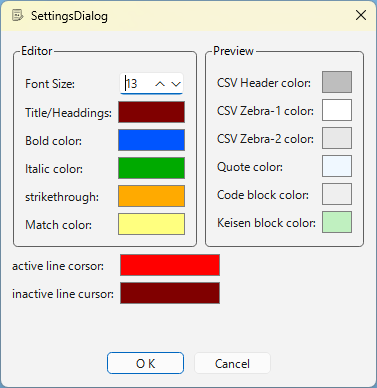
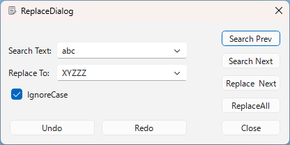

# ダイアログ一覧

## 設定ダイアログ

- エディタフォントサイズ、各種色指定などを行う。
- Other > Settings... F8 で表示される
- エディタ部分、プレビュー部分、全体的な部分に分かれる。

  
※ 現在は文言が英語のみですが、0.3 で日本語化予定です。
- エディタ部分：
  - フォントサイズ（）：
    エディタのフォントサイズを指定します。
  - タイトル/見出しテキスト色：
    タイトル/見出し表示色を指定します。
  - ボールドテキスト色
    **ボールド** テキスト表示色を指定します。
  - イタリックテキスト色
    *イタリック* テキスト表示色を指定します。
  - 打ち消し線テキスト色
    ~~打ち消し線~~ テキスト表示色を指定します。
  - 検索マッチ強調背景色
    検索にマッチしたテキスト表示色を指定します。
- プレビュー部分：
  - CSVヘッダ背景色
    CSVブロック1行目（見出し行）の背景色を指定します。
  - CSVブロックゼブラカラー（偶数行）
    CSV本体の交互の色（ゼブラカラー）を指定します。
  - CSVブロックゼブラカラー（奇数行）
    CSV本体の交互の色（ゼブラカラー）を指定します。
  - 引用ブロック背景色
    引用ブロック背景色を指定します。
  - コードブロック背景色
    コードブロック背景色を指定します。
  - 罫線ブロック背景色
    罫線ブロック背景色を指定します。
- 全体部分
  - アクティブカーソル色
    フォーカスを持つ文字・行カーソルの色を指定します。
  - 非アクティブカーソル色
    フォーカスを持たない文字・行カーソルの色を指定します。

## 置換ダイアログ

- テキスト置換を行う
- Search > Replace... F4 で表示される

- 検索文字列（Search Text）：
検索を行う文字列を入力、または履歴から選択
- 置換文字列（Replace To）：
検索マッチする文字列を置き換える文字列を入力、または履歴から選択
- 大文字小文字同一視（Ignore Case）：
検索時に大文字小文字を同一視するか？
- 【 前検索（Search Prev）】
文書先頭方向に向かって検索
- 【 次検索（Search Next）】
文書末尾方向に向かって検索
- 【 置換・次検索（Replace Next）】
現マッチテキストを置換し、次検索
- 【 全置換（Replace All）】
マッチテキストをすべて置換
- 【 Undo 】
編集処理を元にに戻す（置換操作も対象）
- 【 Redo 】
編集処理を繰り返す（置換操作も対象）
- 【 閉じる（Close）】
置換ダイアログを閉じる

