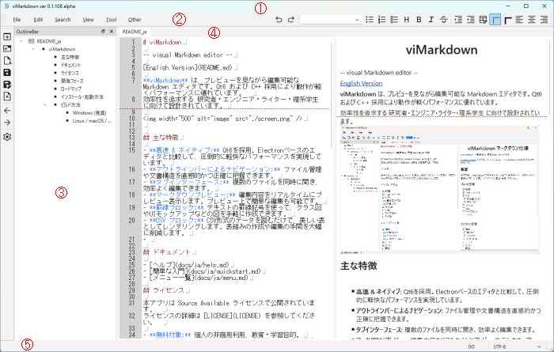

# viMarkdown ヘルプ
[English](../help.md)

## 目次
- [はじめに](#はじめに)
- [基本操作](#基本操作)
- [Markdown仕様](#Markdown仕様)
- [viMarkdown独自仕様](#viMarkdown独自仕様)
  - 罫線ブロック
  - CSVブロック
  - プレビュー内編集
- [FAQ](#FAQ)
- [付録](#付録)


## はじめに

- viMarkdown とは
- 本稿の目的


## 基本操作

### 画面説明



- ① タイトルバー
  アプリ名、最小化・最大化・終了ボタン
- ② メニュー・ツールバー
  マウスクリック・アクセスキー・ショートカットにより各種アクションを実行可能
- ③ アウトラインバー
  オープンしている文書一覧  
  文書内見出しツリー、クリックにより当該見出しにジャンプ
- ④ タブ
  複数の文書をタブで切り替えて表示
  - エディタ（左側）
    マークダウン文書を編集
  - プレビュー（右側）
    レイアウトされたマークダウンを表示
    チェックボックス：マウスクリックで状態反転
    簡単な編集（文字挿入・削除）も可能
- ⑤ ステータスバー
  メッセージ表示、カーソル位置、文字エンコーディング表示

### マークダウン文書オープン・セーブ
- 通常オープン
  ファイル > オープン (Ctrl + O) メニュー またはツールバーの Open をクリック
  ファイルオープンダイアログが表示されるので、オープンする md ファイルを選択する
- 最近のファイル
  ファイル > 最近のファイル メニューを選ぶと、最近オープンしたファイル一覧が表示
  一覧からファイルを選ぶとそのファイルがオープンされる
- お気に入りのファイル
  ファイル > お気に入りのファイル メニューを選ぶと、お気に入りのファイル一覧が表示
  一覧からファイルを選ぶとそのファイルがオープンされる
  ファイル > お気に入りのファイル > 現文書追加 メニューを選ぶと、
  現文書がお気に入りのファイルリストに追加される。
- セーブ
  ファイル > 保存 (Ctrl + S) で現在の文書を上書き保存します
- 別名保存
  名前をつけて保存 (Save As) では、新しいファイル名で保存できます。

※ Tips: 未保存文書にはタブの文書タイトルに '*' が表示されるよ。  
ちゃんと保存したかどうかはこれを確認してね。

### 基本編集
  - 文字入力・削除
  - カーソル移動、文字列選択
  - コピペ
  - Undo/Redo
### ナビゲーション
  - アウトラインバー
  - 文書履歴
  - 直前文書切り替え

## Markdown仕様
  - ブロック
    - タイトル・見出し
    - リスト
    - チェックボックス
    - 連番
    - コードブロック
    - 引用
  - インライン
    - ボールド
    - イタリック
    - 打ち消し戦
    - リンク
    - 画像## viMarkdown独自仕様

## viMarkdown独自仕様

### 罫線ブロック
- 罫線文字を使用し、下図のようなクラス図・UIモックアップ等を容易に作図可能
```keisen background-color: #f0f0f0;
    ┏━━━━━━┓        ┌──────┐
    ┃    User    ┃───→│    Data    │
    ┗━━━━━━┛        └──────┘
```
- Tool > KeisenMode (Shift + F5)：罫線モード ON/OFF
- 罫線モード：Ctrl + 上下左右矢印キー で罫線描画
- 罫線モード：Ctrl Shift + 上下左右矢印キー で罫線消去
- Tool > ThinKeisen：細罫線
- Tool > ThickKeisen：太罫線
- 編集位置右に罫線がある場合、罫線位置を維持（罫線保護機能）
```keisen background-color: #f0f0f0;
    ┏━━━━━━┓
    ┃            ┃
    ┗━━━━━━┛
           │
           │枠内に文字入力しても
           │右側罫線がずれない（罫線保護）
           ↓
    ┏━━━━━━┓
    ┃abcあ       ┃
    ┗━━━━━━┛
```
- 罫線枠内でテキストを左右寄せ・センタリング
```keisen background-color: #f0f0f0;
    ┏━━━━━━┓
    ┃abcあ       ┃
    ┗━━━━━━┛
           │
           │右寄せ (Edit > Format > AlignRight)
           ↓
    ┏━━━━━━┓
    ┃       abcあ┃
    ┗━━━━━━┛
```
- Tool > OpenPrev (Shift + F7)：カーソル行の上に罫線を接続した行作成
- Tool > OpenNext (F7)：カーソル行の下に罫線を接続した行作成
```keisen background-color: #f0f0f0;
    ┏━━━━━━━━┓
    ┃  MarkdownEdit  ┃
    ┠────────┨← この行にカーソルがある場合
    ┠────────┨
    ┗━━━━━━━━┛
           │
           │Tool > OpenNext (F7)
           ↓
    ┏━━━━━━━━┓
    ┃  MarkdownEdit  ┃
    ┠────────┨
    ┃                ┃← 罫線を考慮した行が作成される
    ┠────────┨
    ┗━━━━━━━━┛
```
### CSVブロック
### プレビュー内編集
## FAQ
```CSV
, Questions & Answers
**Q.**, 罫線モード（Shift + F5）で、描いた線が勝手に繋がったり形が変わったりした。  
**A.**, viMarkdownは、上下左右の接続状況を自動判定して最適な罫線文字を選択する「自動結合機能」を備えています。意図しない結合を防ぎたい場合は、周囲に半角スペースを置くか、**Ctrl + Shift + 矢印キー** で不要な部分を消去して調整してください。
**Q.**, 罫線枠内で文字を打っても、枠が右にズレないのはなぜ？  
**A.**, 「罫線保護機能」が働いているためです。枠内で文字を挿入・削除しても、右側にある垂直罫線の位置を維持しようとします。これにより、クラス図やUIモックアップ図のレイアウトを崩さずにテキスト編集が可能です。
<!--
**Q.**, プレビュー画面でチェックボックスをクリックしても反応しない。  
**A.**, プレビューは基本的に読み取り専用ですが、チェックボックス（[ ] や [x]）のみクリックで状態を反転させることができます。クリックしても変わらない場合は、エディタ側でその行が正しいMarkdown書式（行頭の - [ ] など）になっているか確認してください。
-->
**Q.**, CSVブロックを通常のMarkdownテーブルに変換するには？  
**A.**, 対象のCSV ブロック内にカーソルを置き、メニューの **Edit > Convert > CSV -> Markdown Table** を実行してください。逆に通常のテーブルをCSVブロックに変換して管理することも可能です。
**Q.**, エディタでスクロール表示した場所がプレビューで表示されない。  
**A.**, エディタとプレビューは**カーソル位置で同期**しています。エディタでカーソルを移動（または文字入力）すると、プレビュー側も該当する見出しや本文が画面内に収まるよう自動スクロールします。同期を切り替えたい場合は V**iew > Toggle Focus (Ctrl + \)** を活用してください。
**Q.**, 複数の文書を行き来していたら、さっきまで編集していた場所がわからなくなった。  
**A.**, ブラウザのように **Alt + ← (戻る) と Alt + → (進む)** が使えます。これはファイル間の移動だけでなく、同じ文書内での「リンクジャンプ」後の復帰にも対応しており、カーソル位置も含めて復元されます。
**Q.**, 検索ハイライト（黄色）を消したい。  
**A.**, 検索ハイライトを消したい場合は、**Alt + F3 (検索強調クリア)** を押してください。
**Q.**, viのような操作ができると聞きましたが、どのコマンドに対応してる？  
**A.**, 現在（ver 0.2以下）は、**vi コマンドに対応していません**。ver 0.3.xxx から対応予定です。
**Q.**, 非常に長い（数万行以上の）文書を編集すると動作が重くなった。  
**A.**, 現在（ver 0.2以下）は**インクリメンタルパースを行っていない**ため、巨大なファイルのレンダリングには時間がかかる場合があります。**千行程度を目安に、ファイルを分割**して管理することをお勧めします。分割したファイル同士は \[タイトル\](ファイル名.md) でリンクさせれば、スムーズに行き来可能です。
```

## 付録

  - [メニュー一覧](menu.md)
  - [ダイアログ一覧](dialogs.md)
  - ショートカット一覧