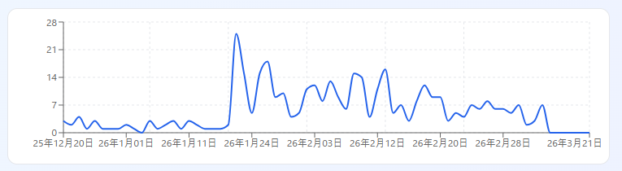

## viMarkdown Download Count

## バージョンごとダウンロード数

<!--
"2025-12-19", "ver 0.0.001 dev", 3, ?,
"2025-12-21", "ver 0.0.002 dev", 2, ?,
"2025-12-23", "ver 0.0.003 dev", 4, ?,
"2025-12-23", "ver 0.0.004 dev", 1, ?,
"2025-12-24", "ver 0.0.005 dev", 3,  ?,
"2025-12-26", "ver 0.0.006 proto", 1, ?, 0.0 のフェーズ名を prototype に変更
"2025-12-27", "ver 0.0.007 proto", 1, ?,
"2025-12-30", "ver 0.0.008 proto", 1, ?,
"2025-12-31", "ver 0.0.009 proto", 2, ?,
"2026-01-01", "ver 0.1.001 dev", 1, ?,
"2026-01-02", "ver 0.1.002 dev", 0, ?,
"2026-01-04", "ver 0.1.003 dev", 3, ?,
"2026-01-05", "ver 0.1.004 dev", 1, ?,
"2026-01-06", "ver 0.1.005 dev", 2, ?,
"2026-01-08", "ver 0.1.006 dev", 3, ?,
"2026-01-10", "ver 0.1.007 dev", 1, ?,
"2026-01-11", "ver 0.1.008 dev", 3, ?,
"2026-01-12", "ver 0.1.009 dev", 1, ?,
"2026-01-14", "ver 0.1.010 dev", 1, ?,
"2026-01-16", "ver 0.1.011 dev", 1, ?,
"2026-01-17", "ver 0.1.012 dev", 1, ?,
"2026-01-19", "ver 0.1.013 dev", 1, ?,
"2026-01-20", "ver 0.1.014 dev", 25, ?, "Qiita Zenn に記事ポスト、
窓の杜アップデート掲載"
"2026-01-22", "ver 0.1.015 dev", 15, ?, 窓の杜アップデート掲載
"2026-01-24", "ver 0.1.016 dev", 5, ?, （※ 土日のため窓の杜は休み）
"2026-01-25", "ver 0.1.017 dev", 15, ?, 窓の杜アップデート掲載
"2026-01-27", "ver 0.1.018 dev", 18, ?, 窓の杜アップデート掲載
"2026-01-28", "ver 0.1.019 dev", 9, ?, 窓の杜アップデート掲載
"2026-01-29", "ver 0.1.020 dev", 10, ?, 窓の杜アップデート掲載
"2026-01-30", "ver 0.1.021 dev", 4, ?, （※ 土日のため窓の杜はお休み）
"2026-01-31", "ver 0.1.022 dev", 5, ?, （※ 同上）
"2026-02-01", "ver 0.1.023 dev", 11, ?, 窓の杜アップデート掲載
"2026-02-02", "ver 0.1.024 dev", 12, ?, 窓の杜アップデート掲載
"2026-02-03", "ver 0.1.025 dev", 8, ?, 窓の杜アップデート掲載
"2026-02-05", "ver 0.1.026 dev", 13, ?, 窓の杜アップデート掲載
"2026-02-06", "ver 0.1.027 dev", 9, ?, 窓の杜アップデート掲載
"2026-02-07", "ver 0.1.028 dev", 6, ?, （※ 土日のため窓の杜はお休み）
"2026-02-08", "ver 0.1.029 dev", 15, ?, 窓の杜アップデート掲載
"2026-02-10", "ver 0.1.101 α", 14, ?, 窓の杜アップデート掲載
"2026-02-11", "ver 0.1.102 α", 4, ?, （※ 祝日のため窓の杜はお休み）
"2026-02-12", "ver 0.1.103 α", 11, ?, 窓の杜アップデート掲載
"2026-02-13", "ver 0.1.104 α", 16, ?, 窓の杜アップデート掲載
"2026-02-14", "ver 0.1.105 α", 5, ?, 
"2026-02-16", "ver 0.1.106 α", 7, ?, 窓の杜アップデート掲載
"2026-02-17", "ver 0.1.107 α", 2, ?, 
"2026-02-17", "ver 0.1.108 α", 8, ?, 窓の杜アップデート掲載
"2026-02-18", "ver 0.1.109 α", 11, ?, 窓の杜アップデート掲載
"2026-02-19", "ver 0.1.110 α", 9, ?, 窓の杜アップデート掲載
"2026-02-20", "ver 0.1.111 α", 8, ?, 窓の杜アップデート掲載
"2026-02-21", "ver 0.1.112 α", 3, ?, （※ 土日のため窓の杜はお休み）
"2026-02-22", "ver 0.1.113 α", 5, ?, （※ 土日のため窓の杜はお休み）
"2026-02-23", "ver 0.1.114 α", 4, ?, （※ 祝日のため窓の杜はお休み）
"2026-02-24", "ver 0.1.115 α", 7, ?, 窓の杜アップデート掲載
"2026-02-25", "ver 0.1.116 α", 6, ?, 窓の杜アップデート掲載
"2026-02-26", "ver 0.1.117 α", 8, 12, 窓の杜アップデート掲載
"2026-02-27", "ver 0.1.118 α", 6, 11, 窓の杜アップデート掲載
"2026-02-28", "ver 0.1.119 α", 4, ?, 窓の杜アップデート掲載
-->

```CSV
date, version, count, visitors, 補足
"2026-03-02", "ver 0.1.120 α", 5, 10, 窓の杜アップデート掲載
"2026-03-03", "ver 0.1.121 α", 7, 13, 窓の杜アップデート掲載
"2026-03-06", "ver 0.1.122 α", 2, ?, 窓の杜アップデートはなぜかお休み
"2026-03-08", "ver 0.1.123 α", 3, 11, 窓の杜アップデート掲載
"2026-03-10", "ver 0.1.201 β", 7, 12, 窓の杜アップデート掲載
"2026-03-13", "ver 0.1.202 β", 13?, 25, 窓の杜アップデート掲載
"2026-03-15", "ver 0.1.203 β", < 4, < 8, 
"2026-03-17", "ver 0.1.204 β", 8?, 16, 窓の杜アップデート掲載
"2026-03-19", "ver 0.1.205 β", 13?, 26, 窓の杜アップデート掲載
"2026-03-20", "ver 0.1.206 β", < 4, < 8, 
"2026-03-21", "ver 0.1.207 β", < 4, < 8, 
"2026-03-22", "ver 0.1.208 β", < 4, < 8, 
"2026-03-23", "ver 0.1.209 β", 33?, 66, 窓の杜アップデート掲載
"2026-03-25", "ver 0.1.210 β", 5?, 10, 窓の杜アップデート掲載
"2026-03-27", "ver 0.1.211 β",  6, 14, 窓の杜アップデート掲載
"2026-03-28", "ver 0.1.212 β",  4, ?, 
"2026-03-30", "ver 0.1.213 β",  4, 14, 窓の杜アップデート掲載
"2026-03-31", "ver 0.1.214 β",  9, 17, 窓の杜アップデート掲載
"2026-04-01", "ver 0.1.215 β",  7, 12, 窓の杜アップデート掲載
"2026-04-02", "ver 0.1.216 β", 13, 19, 窓の杜アップデート掲載
"2026-04-04", "ver 0.1.217 β",  2, ?, 
"2026-04-05", "ver 0.1.218 β",  3, ?, 
"2026-04-06", "ver 0.1.219 β",  7, 20, 窓の杜アップデート掲載
"2026-04-07", "ver 0.1.220 β", 13, 20, 窓の杜アップデート掲載
"2026-04-09", "ver 0.1.221 β", 15, 14, 窓の杜アップデート掲載
```
<!--

-->

## viMarkdown ダウンロード数 週次集計

```CSV
週の期間,週次合計,累計,状況・主な出来事
"2025/12/15 - 12/21",  5, 5,"プロジェクト初期公開、prototype版"
"2025/12/22 - 12/28", 10, 15,""
"2025/12/29 - 01/04",  7, 22,"年末年始 / ver 0.1 dev 開始"
"2026/01/05 - 01/11", 10, 32,""
"2026/01/12 - 01/18",  4, 36,""
"2026/01/19 - 01/25", 61, 97,"Qiita/Zenn投稿、窓の杜掲載で急増"
"2026/01/26 - 02/01", 49, 146,"窓の杜アップデート掲載継続"
"2026/02/02 - 02/08", 63, 209,""
"2026/02/09 - 02/15", 50, 259,"α版へ移行"
"2026/02/16 - 02/22", 53, 312,""
"2026/02/23 - 03/01", 35, 347,""
"2026/03/02 - 03/08", 16, 363,""
"2026/03/09 - 03/15", 24, 387,"β版へ移行"
"2026/03/16 - 03/22", 33, 420,""
"2026/03/23 - 03/29", 48, 468,"自動テスト追加"
"2026/03/30 - 04/05", 38, 506,""
"2026/04/06 - 04/12", 35, 541,""
```

