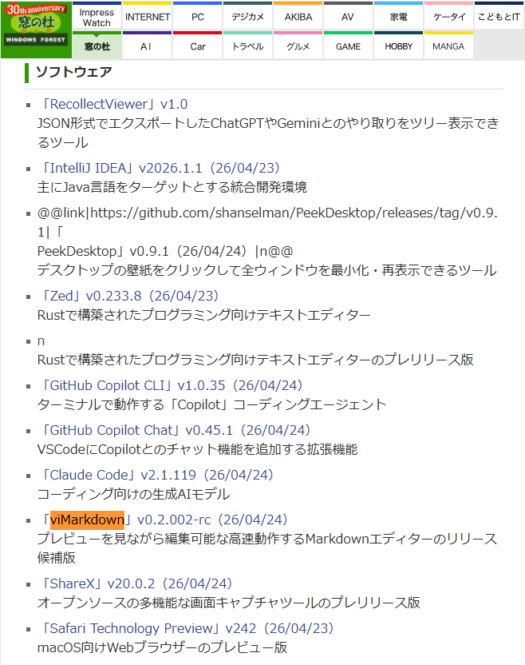
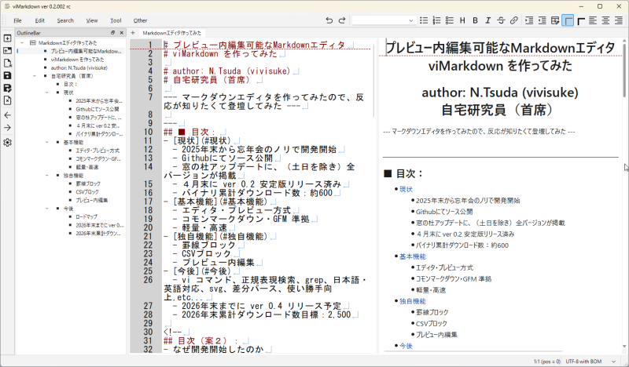

# プレビュー内編集可能なMarkdownエディタ
# viMarkdown を作ってみた

# author: N.Tsuda (vivisuke)
# 自宅研究員（首席）

--- マークダウンエディタを作ってみたので、反応が知りたくて登壇してみた ---

---
## ■ 目次：
- [現状](#現状)
  - 2025年末から忘年会のノリで開発開始
  - Githubにてソース公開
  - 窓の杜アップデートに、（土日を除き）全バージョンが掲載
  - ４月末に ver 0.2 安定版リリース済み
  - バイナリ累計ダウンロード数：約600
- [基本機能](#基本機能)
  - エディタ・プレビュー方式
  - コモンマークダウン・GFM 準拠
  - 軽量・高速
- [独自機能](#独自機能)
  - 罫線ブロック
  - CSVブロック
  - プレビュー内編集
- [今後](#今後)
  - vi コマンド、正規表現検索、grep、日本語・英語対応、svg、差分パース、使い勝手向上,etc...
  - 2026年末までに ver 0.4 リリース予定
  - 2026年末累計ダウンロード数目標：2,500

<!--
## 目次（案２）：
- なぜ開発開始したのか
- 何を作ったのか
  - ライブプレビュー方式
  - コモンマークダウン・GFM 準拠
  - 独自機能：罫線ブロック、CSVブロック
  - 軽量・高速
- 一番の特徴
  - プレビュー内編集
- 実績
  - 窓の杜アップデートに、（土日を除き）全バージョンが掲載
  - バイナリ累計ダウンロード数：約600
- 今後のロードマップ
-->
---
## ■ 現状
### 2025年末から忘年会のノリで開発開始
- Qiita: [vi の名を冠するマークダウンエディタを 忘年会のノリで開発開始してしまった話](https://qiita.com/vivisuke2025/items/448a87b20ba7dd6e2132) 
- Zenn: [vi の名を冠するマークダウンエディタを 忘年会のノリで開発開始してしまった話](https://zenn.dev/vivisuke/articles/5fe9e5e0c25aae) 
### Githubにてソース公開
- https://github.com/vivisuke/viMarkdown/
### 窓の杜アップデートに、（土日を除き）全バージョンが掲載
- https://forest.watch.impress.co.jp/category/other/topic/update/


### ４月末に ver 0.2 安定版リリース
- https://github.com/vivisuke/viMarkdown/releases
### バイナリ累計ダウンロード数：約600
- https://github-release-stats.alpha49.com/


---
## ■ 基本機能
### エディタ・プレビュー方式
- undone: 画面スクショ？


### コモンマークダウン・GFM 準拠
### 軽量・高速
- Qt6 C++ 採用

---
## ■ 独自機能
### 罫線ブロック
- 簡単な図形・UIモックアップ等を簡単に作成可
- \```keisen, \``` で囲む
- 罫線モード：Ctrl + 上下左右キー 罫線描画、Shift + Ctrl + 上下左右キー 罫線消去
- 罫線保護
- 左右中央揃え
```keisen
    ┏━━━━━━━┓
    ┃  class Name  ┃
    ┠───────┨
    ┠───────┨
    ┗━━━━━━━┛
```
### CSVブロック
- \`\`\`CSV, \`\`\` で囲み、CSVテキストをそのまま記述
- GFM表と相互変換可能

> ```CSV
> 氏名,年齢,部署
> 田中太郎,30,営業
> 佐藤花子,25,開発
> ```
　　↓

```CSV
氏名,年齢,部署
田中太郎,30,営業
佐藤花子,25,開発
```

### プレビュー内編集
- プレピュー内で簡単な編集（文字挿入・削除）可能

---
## ■ 今後
### ロードマップ
|　ver.　|　概要　|　スケジュール　|
|:---:|----|----|
|0.2|基本エディタ機能、基本マークダウン、罫線ブロック、CSVブロック、プレビューワ上編集（限定的）|2026/04/End 安定版リリース予定（win版のみ）
|0.4|viコマンド、メニュー等日本語・英語対応、正規表現検索、grep, 矩形選択、SVGブロック？、使い勝手向上、パフォーマンス向上、CMake化（QtCreator/Mac/Linux？対応）|2026/05 dev版、08 alpha版、10 beta版開始予定。2026/12 RC版・安定版（Win版・Mac版バイナリ？）リリース予定
|0.6|数式表示、マインドマップ？、ページビュー（段組み、脚注）？、プレゼンモード？、フォルダ表示？|未定|
|0.8|マーメイド？|未定|
|1.0|未定|未定|
### 2026年末までに ver 0.4 リリース予定
### 2026年末累計ダウンロード数目標：2,500